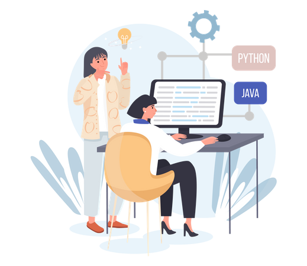

### Hi there 👋

## I'm Taban Soleymani

<!---

--->
 
<table align="center">
  <tr>
    <td width="55%">
      

         
        
      

    </td>
    <td width="45%">
      

         
        
      

    </td>
  </tr>
</table>
 

<h2> 💻 &nbsp;About Me </h2>
 
<blockquote>
  
 
    I majored in electrical engineering (Thesis Title: "Designing
    IoT Network Simulator Based on MQTT Protocol"), and my 
    m.sc. research is focused on reinforcement learning-based
    edge-caching in IoV networks. 
    Here I share my hands-on  
    and course project repositories.
  

</blockquote>
 <ul>
  <li>🎓 &nbsp; M.Sc of Electrical Engineering - Communication Networks at <a href="https://ut.ac.ir/en">UT</a></li>
  <li>🎓 &nbsp; B.Sc of Electrical Engineering - Communication at <a href="https://ut.ac.ir/en">UT</a></li>
  <li>👩‍💻 &nbsp; Back-end Developer </li>
  <li>🤔 &nbsp; Interested in Communication Networks and Machine Learning</li>
 </ul>
  
<h2> 🛠 &nbsp;Tech Stack</h2>
<table align="center">
  <tr>
    <td width="65%">
      

         
        <ul>
          <li>
            
            
            
            
            
            
            
            
            
            
          </li>
          <li>
            
            
            
            
          </li>
          <li>
            
            
            
            
            
          </li>
          <li>
            
            
            
          </li>
          <li>
            
            
            
          </li>
          <li>
            
            
            
            
            
            
          </li>
          <li>
            
            
          </li>
          <li>
            
          </li>
        </ul>
      

    </td>
    <td width="35%">
      

         
        <a href="https://github.com/Taabannn">
        
      

    </td>
  </tr>
</table>

<!---
Taabannn/Taabannn is a ✨ special ✨ repository because its `README.md` (this file) appears on your GitHub profile.
You can click the Preview link to take a look at your changes.
--->
